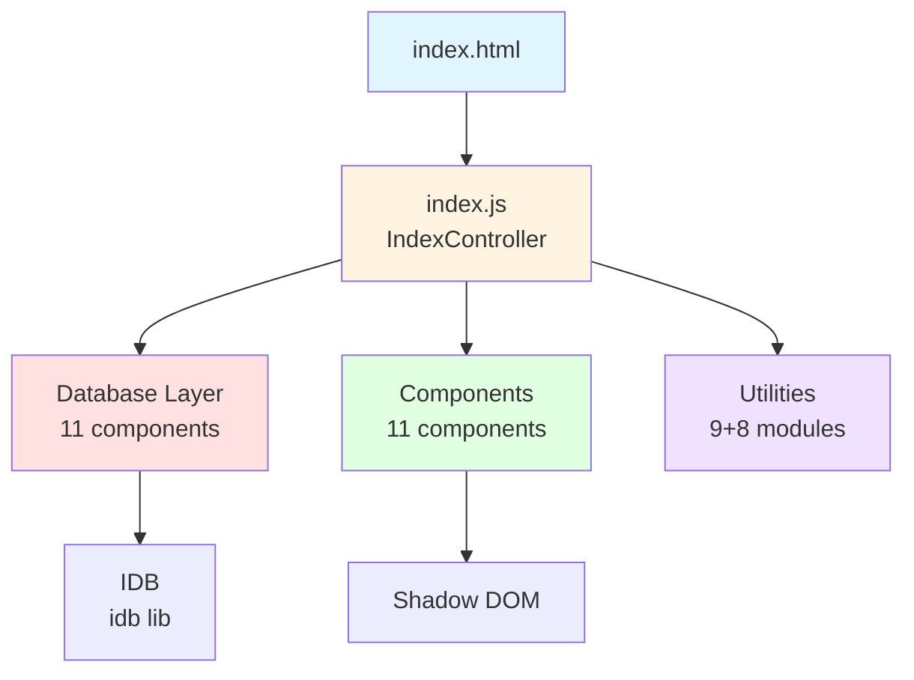
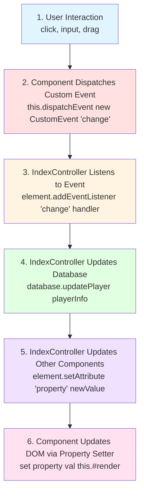
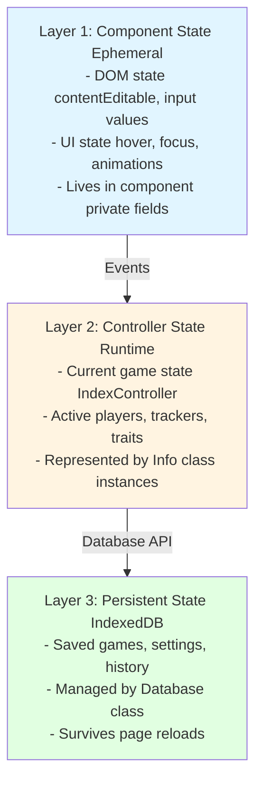
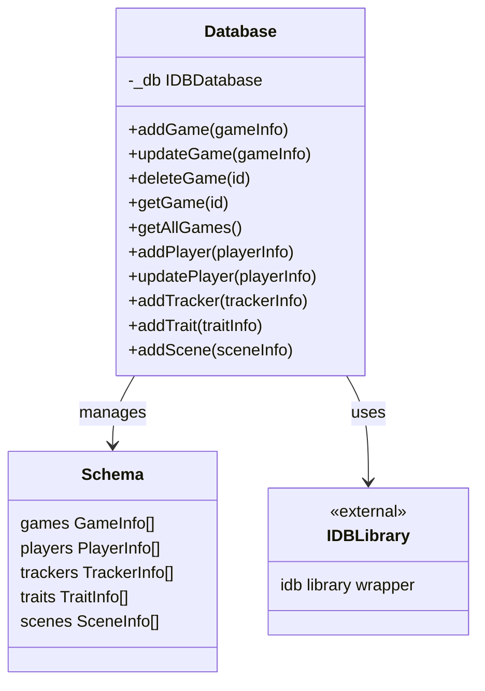
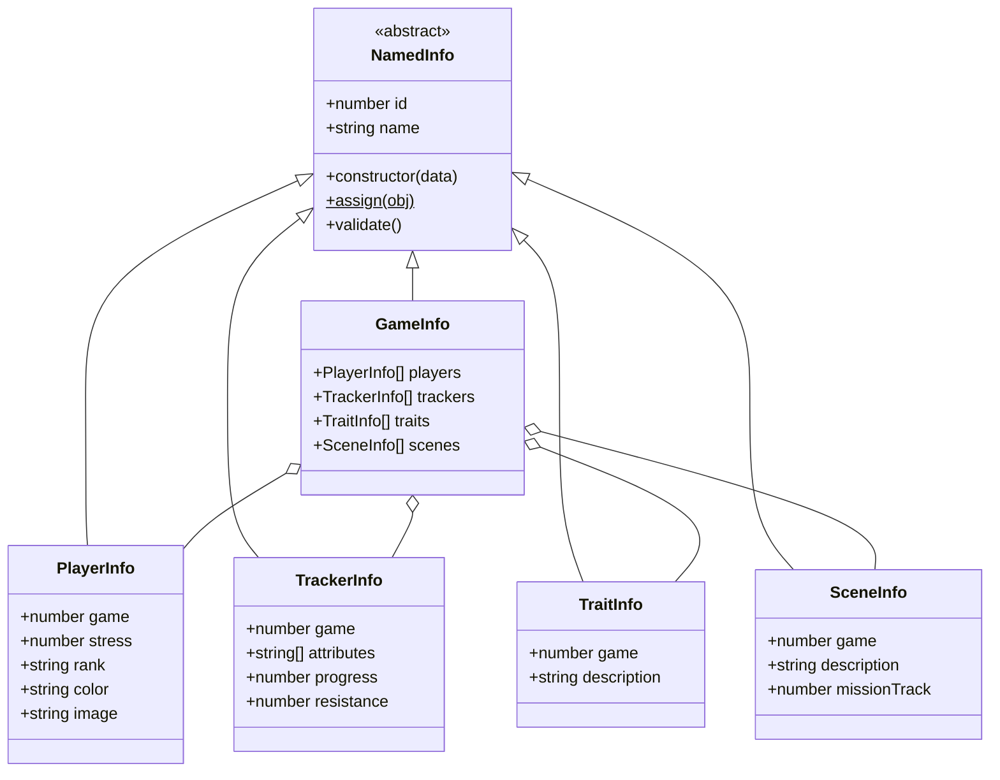

# STA Play Architecture Guide

This document explains the architecture, patterns, and data flow in the STA Play web application.

## Table of Contents
- [Overview](#overview)
- [Architecture Diagram](#architecture-diagram)
- [Component Architecture](#component-architecture)
- [Data Flow](#data-flow)
- [State Management](#state-management)
- [Component Communication](#component-communication)
- [Database Layer](#database-layer)
- [Patterns and Conventions](#patterns-and-conventions)

## Overview

STA Play is a client-side single-page application (SPA) built with vanilla JavaScript and Web Components. It uses IndexedDB for persistent storage and follows a component-based architecture where:

- **Web Components** handle UI and user interactions
- **IndexController** coordinates between UI and data
- **Database layer** manages IndexedDB persistence
- **Info classes** represent data models

## Architecture Diagram



```
Components Breakdown:
├─ Dialogs (5)
│  ├─ welcome-dialog      - Initial setup wizard
│  ├─ settings-dialog     - App configuration
│  ├─ busy-dialog         - Loading indicator
│  ├─ message-dialog      - Info/alerts
│  └─ confirm-dialog      - Yes/no confirmations
│
├─ Displays (3)
│  ├─ player-display      - Player card with stats
│  ├─ trait-display       - Individual trait/aspect
│  └─ ship-alert          - Ship alert status (3D model)
│
└─ Trackers (3)
   ├─ task-tracker        - Task/challenge progress
   ├─ mission-tracker     - Mission/scene tracking
   └─ input-progress      - Numeric progress widget
```

## Component Architecture

### Web Components (Shadow DOM)

All 11 components use Web Components API with Shadow DOM for encapsulation:

**Standard Component:**
```javascript
export class MyElement extends HTMLElement {
  // 1. Declare observed attributes
  static get observedAttributes() { 
    return ['attribute-name'] 
  }

  // 2. Private fields for encapsulation
  #privateField
  #domReference

  // 3. Constructor: Setup Shadow DOM
  constructor() {
    super()
    const shadow = this.attachShadow({ mode: 'open' })
    
    // Load external CSS
    const link = document.createElement('link')
    link.rel = 'stylesheet'
    link.href = 'components/my-element/my-element.css'
    shadow.appendChild(link)
    
    // Build DOM
    this.#domReference = document.createElement('div')
    shadow.appendChild(this.#domReference)
  }

  // 4. Handle attribute changes
  attributeChangedCallback(name, oldValue, newValue) {
    this[snakeToCamel(name)] = newValue
  }

  // 5. Property getters/setters
  get propertyName() { return this.#privateField }
  set propertyName(val) {
    this.#privateField = val
    // Update DOM
  }
}

// 6. Register the element
customElements.define('my-element', MyElement)
globalThis.MyElement = MyElement
```

**Dialog Component (extends HTMLDialogElement):**
```javascript
const setup = async () => {
  const dialogEl = await loadElementFromFile('./path.html', 'dialog')
  
  class MyDialogElement extends HTMLDialogElement {
    constructor() {
      super()
      this.innerHTML = dialogEl.innerHTML
      // Setup event listeners
    }
  }
  
  customElements.define('my-dialog', MyDialogElement, { extends: 'dialog' })
  globalThis.MyDialogElement = MyDialogElement
}
await setup()
```

### Component Responsibilities

| Component | Responsibility | State |
|-----------|---------------|-------|
| **player-display** | Display player stats (name, rank, stress, color) | Stateless (receives data via attributes) |
| **trait-display** | Display individual trait/aspect with remove button | Stateless |
| **ship-alert** | Show ship alert status with 3D model | Minimal (alert level) |
| **task-tracker** | Track task progress, resistance, breakthroughs | Internal state (synced to DB) |
| **mission-tracker** | Track mission acts/scenes, outcomes | Internal state (synced to DB) |
| **input-progress** | Numeric input with progress visualization | Stateless widget |
| **welcome-dialog** | Initial setup wizard | Session state |
| **settings-dialog** | App configuration | Config state |
| **busy-dialog** | Loading indicator | Show/hide state |
| **message-dialog** | Display messages/alerts | Content state |
| **confirm-dialog** | Yes/no confirmations | Promise-based state |

## Data Flow

### Unidirectional Data Flow



### Example: Updating Player Name

1. User types in `<player-display>` name field (contentEditable)
2. Component detects `input` event
3. Component dispatches `CustomEvent('change', { detail: { name } })`
4. IndexController receives event
5. IndexController updates `PlayerInfo` object
6. IndexController calls `database.updatePlayer(playerInfo)`
7. IndexController may update other components if needed
8. Database saves to IndexedDB asynchronously

## State Management

### Three-Layer State Architecture



### State Ownership Rules

1. **Components own UI state only** (focus, hover, temp input)
2. **IndexController owns runtime game state** (current game)
3. **Database owns persistent state** (saved games)
4. **Components never directly access Database** (go through IndexController)
5. **IndexController never directly manipulates Component internals** (use attributes/properties)

## Component Communication

### Event-Based Communication

Components communicate exclusively through events:

```javascript
// Component dispatches event (bubbles to IndexController)
this.dispatchEvent(new CustomEvent('player-removed', {
  detail: { playerIndex: 0 },
  bubbles: true,
  composed: true  // If needs to cross shadow DOM boundary
}))

// IndexController listens
document.getElementById('player-list').addEventListener('player-removed', (e) => {
  const { playerIndex } = e.detail
  // Handle removal
})
```

### Common Events

| Event | Component | Payload | Purpose |
|-------|-----------|---------|---------|
| `change` | player-display | `{ name, rank, stress, ... }` | Player data changed |
| `removed` | trait-display | `{ traitId }` | Trait removed |
| `progress-change` | task-tracker | `{ progress, resistance }` | Task progress updated |
| `scene-complete` | mission-tracker | `{ sceneIndex, outcome }` | Scene finished |
| `alert-changed` | ship-alert | `{ alertLevel }` | Ship alert changed |

### No Direct Component Access

❌ **Bad:**
```javascript
// IndexController directly modifying component
const player = document.querySelector('player-display')
player.shadowRoot.querySelector('.name').textContent = 'New Name'
```

✅ **Good:**
```javascript
// Use public API (attributes/properties)
const player = document.querySelector('player-display')
player.setAttribute('name', 'New Name')
// or
player.name = 'New Name'
```

## Database Layer

### Database Architecture



### Info Class Hierarchy



### Database Operations Flow

```javascript
// 1. Create Info object
const playerInfo = new PlayerInfo({
  name: 'Jean-Luc Picard',
  rank: '⬤⬤⬤⬤:Officer',
  stress: 0
})

// 2. Validate
playerInfo.validate()  // Throws if invalid

// 3. Save to database
const playerId = await database.addPlayer(playerInfo)

// 4. Retrieve
const player = await database.getPlayer(playerId)

// 5. Update
player.stress = 2
await database.updatePlayer(player)

// 6. Delete
await database.deletePlayer(playerId)
```

## Patterns and Conventions

### Naming Conventions

| Context | Convention | Example |
|---------|-----------|---------|
| Component tag name | kebab-case | `<player-display>` |
| Component class | PascalCase + Element suffix | `PlayerDisplayElement` |
| Attributes | kebab-case | `player-index` |
| Properties | camelCase | `playerIndex` |
| Private fields | # prefix + camelCase | `#playerData` |
| Info classes | PascalCase + Info suffix | `PlayerInfo` |
| Utility functions | camelCase | `snakeToCamel()` |
| Constants | UPPER_SNAKE_CASE or PascalCase arrays | `MAX_PLAYERS`, `AttributeNames[]` |

### Attribute ↔ Property Sync

Always use `snakeToCamel()` for automatic attribute-to-property sync:

```javascript
import { snakeToCamel } from '../../js/string-utils.js'

attributeChangedCallback(name, oldValue, newValue) {
  // Automatically converts 'player-index' → 'playerIndex'
  this[snakeToCamel(name)] = newValue
}
```

### File Organization

```
components/
├─ component-name/
│  ├─ component-name-element.js    # Component logic
│  ├─ component-name.css           # Component styles
│  └─ component-name.html          # (For dialogs only)

js/
├─ utility-name.js                 # Utility functions
└─ database/
   ├─ database.js                  # Database class
   └─ info-class-name.js           # Info class

test/
├─ components/
│  └─ component-name/
│     └─ component-name-element.test.js
└─ js/
   └─ utility-name.test.js
```

### Configuration as Data

Keep game rules as constants at the top of files:

```javascript
// Good - Data-driven configuration
const AttributeNames = [
  'Control', 'Daring', 'Fitness', 
  'Insight', 'Presence', 'Reason'
]

const DepartmentNames = [
  'Command', 'Conn', 'Security', 
  'Engineering', 'Science', 'Medicine'
]

// Component uses these arrays to generate UI
AttributeNames.forEach(attr => {
  const checkbox = document.createElement('input')
  checkbox.type = 'checkbox'
  checkbox.value = attr
  // ...
})
```

### Error Handling

```javascript
// Validation in Info classes
validate() {
  if (!this.name || this.name.trim() === '') {
    throw new Error('Name is required')
  }
  if (this.stress < 0) {
    throw new Error('Stress cannot be negative')
  }
}

// Graceful fallbacks in components
get propertyName() {
  return this.#field ?? 'Default Value'
}

// Database error handling
try {
  await database.updatePlayer(playerInfo)
} catch (error) {
  console.error('Failed to update player:', error)
  // Show error dialog
  showDialog('message-dialog', {
    message: 'Failed to save changes'
  })
}
```

## IndexController Responsibilities

The `IndexController` class (in `index.js`) acts as the application controller:

1. **Initialization**
   - Load database
   - Load initial game state
   - Initialize components
   - Setup event listeners

2. **Coordination**
   - Listen to component events
   - Update database on changes
   - Sync state across components
   - Handle routing/navigation

3. **Business Logic**
   - Game rules enforcement
   - Save/load game files (`.staplay` format)
   - Export/import functionality
   - Mirror window management

4. **Not Responsible For**
   - UI rendering (components do this)
   - Direct DOM manipulation (use component APIs)
   - Database implementation details (use Database API)

## Extension Points

### Adding a New Component

1. Create component directory: `components/new-component/`
2. Create files: `new-component-element.js`, `new-component.css`
3. Follow standard component pattern (see COMPONENT_TEMPLATE.md)
4. Register in `index.html` (import the JS file)
5. Add to IndexController if needs coordination
6. Create comprehensive tests in `test/components/new-component/`

### Adding a New Info Class

1. Create file: `js/database/new-info.js`
2. Extend `NamedInfo` or another base class
3. Implement: constructor (with type coercion), `static assign()`, `validate()`
4. Add database methods in `database.js`
5. Add object store in database upgrade logic (if needed)
6. Create tests in `test/js/database/`

### Adding a New Utility

1. Create file: `js/new-utility.js`
2. Export functions (use ES modules)
3. Add comprehensive JSDoc comments
4. Handle edge cases (null, undefined, empty)
5. Create tests in `test/js/new-utility.test.js`

## Browser Compatibility

All code must work in current versions of:
- Chrome/Edge (Chromium)
- Firefox
- Safari

**Key Compatibility Concerns:**
- Use `contentEditable="plaintext-only"` with fallback to `"true"` for Safari
- Test Shadow DOM features across browsers
- Avoid cutting-edge CSS features (or use fallbacks)
- Test IndexedDB operations (quota limits vary)
- Verify custom element support (all modern browsers support it)

## Performance Considerations

- **Shadow DOM:** Provides style encapsulation without performance cost
- **IndexedDB:** Asynchronous operations don't block UI
- **No Virtual DOM:** Direct DOM manipulation is fast for small component counts
- **Lazy Loading:** Components loaded on demand via ES modules
- **CSS:** Scoped to Shadow DOM, no global cascade

## Security

- **No server:** Client-side only, no backend to attack
- **No eval:** No dynamic code execution
- **Input validation:** All user input validated (Info class `validate()` methods)
- **No inline scripts:** All JS in separate files
- **CSP friendly:** No inline styles (CSS in separate files)

## Testing Strategy

See [TESTING.md](TESTING.md) for comprehensive testing guide.

**Test Coverage by Layer:**
- ✅ **Info classes:** Well tested (constructor, assign, validate)
- ✅ **Utilities:** Well tested (edge cases, error conditions)
- ⚠️ **Components:** Partial (6 components missing tests)
- ❌ **Integration:** No tests (IndexController + components interaction)
- ❌ **E2E:** No tests (full user workflows)

## Future Improvements

Potential architectural enhancements:

1. **TypeScript:** Add type safety (currently using JSDoc)
2. **Build step:** Bundle for production (currently no build)
3. **State management library:** Replace IndexController (consider MobX/Redux)
4. **Component library:** Extract reusable components
5. **E2E testing:** Add Playwright E2E tests
6. **Service Worker:** Add offline support (PWA)
7. **Virtual DOM:** Consider lit-html for complex components
8. **Web Workers:** Offload database operations

## Resources

- [Web Components MDN](https://developer.mozilla.org/en-US/docs/Web/Web_Components)
- [Shadow DOM MDN](https://developer.mozilla.org/en-US/docs/Web/Web_Components/Using_shadow_DOM)
- [IndexedDB MDN](https://developer.mozilla.org/en-US/docs/Web/API/IndexedDB_API)
- [Custom Elements v1](https://html.spec.whatwg.org/multipage/custom-elements.html)
- [idb library](https://github.com/jakearchibald/idb)
