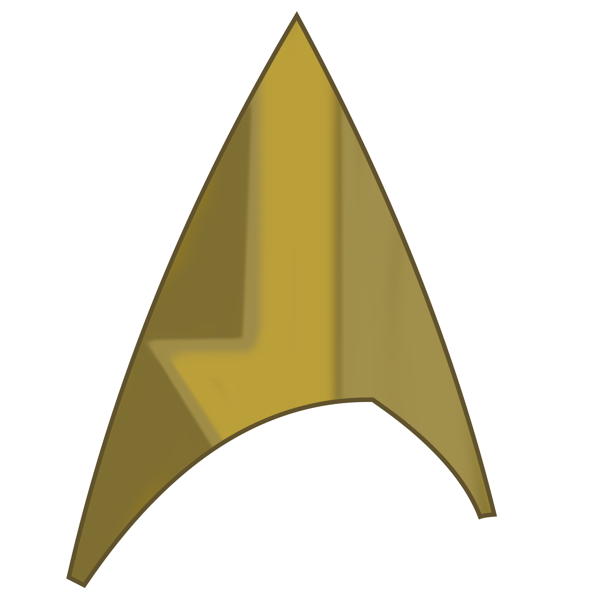

[](/img/icon.webp)
Play App for Star Trek Adventures
=============================================================================================

[](https://samsarette.itch.io/sta-play)
[](https://github.com/lunarcloud/sta-play-webapp/blob/main/LICENSE)
[](https://github.com/lunarcloud/sta-play-webapp/pulse)
[](https://developer.mozilla.org/en-US/docs/Glossary/Browser)


A utility for GMs running a game of Star Trek Adventures TTRPG or players of the Captain's Log Solo RPG to display high-level player information during a game session.

## Development Setup

### Initial Setup
```sh
npm i                              # Install dependencies
npm run copy-deps                  # Copy third-party libraries to js/lib/
npx playwright install chromium    # Install browser for testing (one-time)
npm run serve                      # Start development server
```

The application will be available at `http://localhost:3000` (or the next available port).

### Available Commands

| Command | Description |
|---------|-------------|
| `npm run serve` | Start local development server |
| `npm run lint` | Run all linters (JavaScript, HTML, CSS) |
| `npm run lint-fix` | Auto-fix linting issues where possible |
| `npm test` | Run unit tests once |
| `npm run test:watch` | Run tests in watch mode |
| `npm run test:coverage` | Generate test coverage report |
| `npm run cem` | Generate custom elements manifest for IDE support |

### Code Quality

Before committing, run:
```sh
npm run lint-fix    # Fix style issues
npm test            # Verify all tests pass
```

The project has three linters configured:
- **ESLint** for JavaScript - enforces code style and JSDoc validation
- **linthtml** for HTML - validates structure and accessibility
- **stylelint** for CSS - ensures consistent styling

📘 **For detailed information:**
- Architecture and patterns: [.github/ARCHITECTURE.md](.github/ARCHITECTURE.md)
- Creating new components: [.github/COMPONENT_TEMPLATE.md](.github/COMPONENT_TEMPLATE.md)
- Code review guidance: [.github/CODE_REVIEW_GUIDE.md](.github/CODE_REVIEW_GUIDE.md)
- Linting rules and configuration: [.github/LINTING.md](.github/LINTING.md)
- Testing patterns and best practices: [.github/TESTING.md](.github/TESTING.md)
- Contributing guidelines: [CONTRIBUTING.md](CONTRIBUTING.md)

## Testing
The project uses [@web/test-runner](https://modern-web.dev/docs/test-runner/overview/) for unit testing with browser-native ES modules support.

### Running Tests
```sh
# Run tests once
npm test

# Run tests in watch mode (reruns on file changes)
npm run test:watch

# Run tests with coverage report
npm run test:coverage
```

### Test Structure
- Test files are located in the `test/` directory
- Test files follow the `*.test.js` naming convention
- Tests use Chai for assertions
- Tests run in real browser environments (Chromium via Playwright)
- Coverage reports are generated in the `coverage/` directory

### Writing Tests
All components and utility modules should have comprehensive tests:

**For Components:**
- Test custom element registration
- Test shadow DOM structure
- Test attributes and properties
- Test event dispatching
- Test user interactions
- Test edge cases and error handling

**For Utilities:**
- Test all exported functions
- Test edge cases (null, undefined, empty values)
- Test error conditions
- Test with various data types

See `test/components/trait-display/trait-display-element.test.js` for a comprehensive example.

## Code Quality Tools
The project has linters for the HTML, CSS, and JavaScript all setup and configured.
Simply run `npm run lint-fix` to run all of them in "fix what you can automatically" mode.
